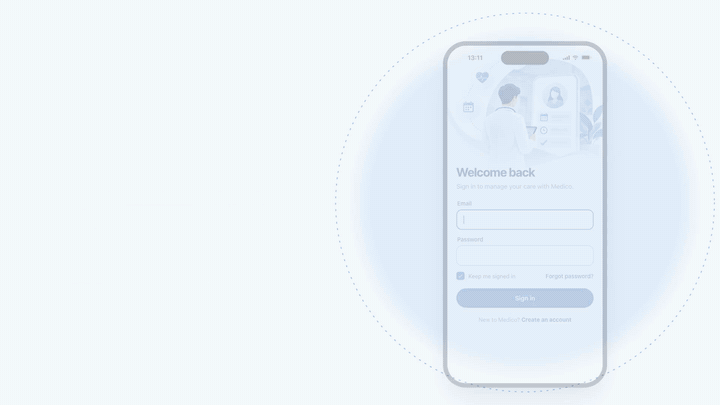
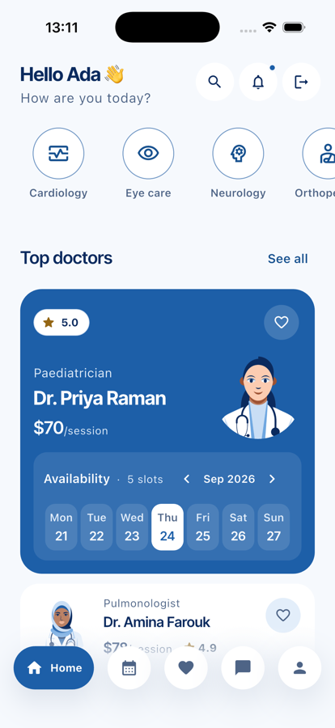
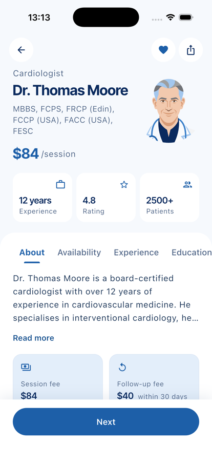
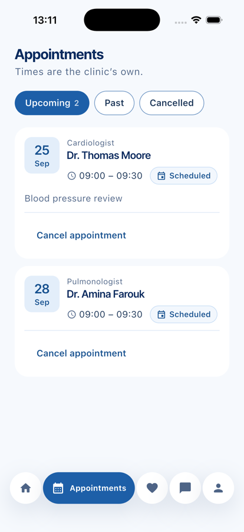
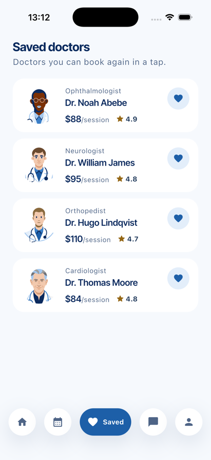
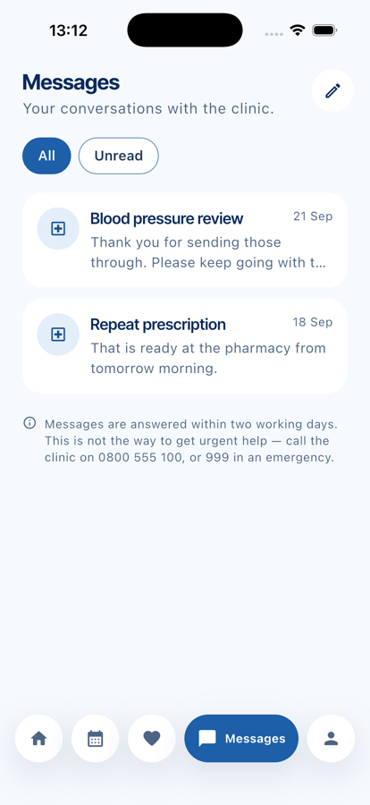
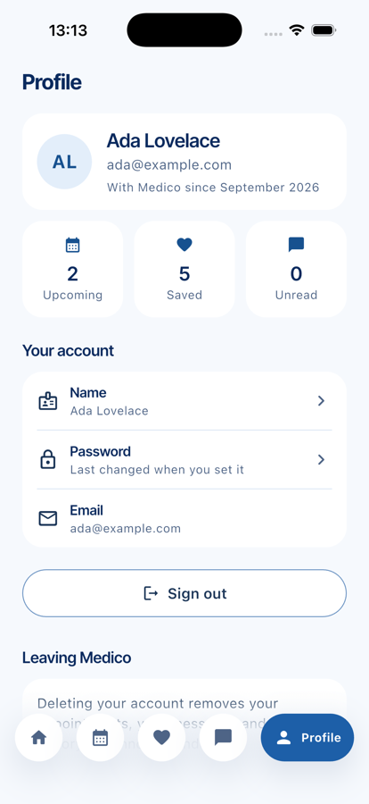

# Medico

<p align="center">
  <a href="docs/promo/medico-promo.mp4"></a><br>
  <sub>21-second promo — <a href="docs/promo/medico-promo.mp4">watch with sound (MP4)</a></sub>
</p>

A patient app for booking and managing care with a clinic — find a doctor, see
when they are free, book, and keep the conversation afterwards.

Flutter on the front, Node and MongoDB behind it. Everything on screen comes
from the API; there is no mock data left in the app.

> **v0.** Working end to end and covered by 345 tests, but not production
> ready — see [Known gaps](#known-gaps) before deploying it anywhere real.

## Screens

<table>
  <tr>
    <td align="center"><br><sub><b>Directory</b></sub></td>
    <td align="center"><br><sub><b>Doctor</b></sub></td>
    <td align="center"><br><sub><b>Appointments</b></sub></td>
  </tr>
  <tr>
    <td align="center"><br><sub><b>Saved doctors</b></sub></td>
    <td align="center"><br><sub><b>Messages</b></sub></td>
    <td align="center"><br><sub><b>Profile</b></sub></td>
  </tr>
</table>

## What it does

- **Sign in, sign up, request a password reset.** Sessions survive a restart
  when "Keep me signed in" is on, and end everywhere when the server says so.
- **Browse the directory** by specialty, with availability generated on read
  rather than stored.
- **Book and cancel.** Cancelling hands the slot straight back to the clinic.
- **See what is booked** — upcoming, past and cancelled, each its own question
  to the server rather than a filter applied on the phone.
- **Save doctors** for one-tap rebooking, with an undo on every removal.
- **Message the practice** about an appointment, a result or a prescription.
- **Manage the account** — rename, change password, sign out, delete it.

## Stack

| | |
|---|---|
| **Client** | Flutter 3.47 (stable) · Dart 3.13 · iOS + Android |
| **Client deps** | `http`, `shared_preferences` — and nothing else |
| **Server** | Node 20+ · TypeScript 5.7 · Express 5 |
| **Database** | MongoDB with Mongoose 8 |
| **Validation** | Zod, at every request boundary |
| **Auth** | JWT access tokens + opaque rotating refresh tokens |
| **Security** | Helmet, CORS allow-list, per-IP rate limiting, scrypt password hashing |
| **Tests** | `flutter_test` with golden renders · Vitest + Supertest |

The client's dependency list is deliberately two packages long. Both are
first-party Flutter plugins with no native build step, which is the same
reasoning that put password hashing on Node's built-in scrypt instead of
bcrypt or argon2: a service that must come up reliably is worth more than a
marginal gain that breaks on some CI image.

## Running it

**You will need** Flutter, Node 20+, and a MongoDB on `127.0.0.1:27017`.

```bash
# 1. the API
cd server
cp .env.example .env            # then fill in the two secrets
npm install
npm run seed                    # 6 doctors, a demo patient, two conversations
npm run dev                     # http://localhost:4000

# 2. the app, in another terminal
flutter pub get
flutter run
```

Generate the two secrets with:

```bash
node -e "console.log(require('crypto').randomBytes(48).toString('base64url'))"
```

Seeded sign-in: **`ada@example.com` / `medico1234`**

Point the app somewhere other than localhost at build time:

```bash
flutter run --dart-define=MEDICO_API_BASE_URL=https://api.example.com/api/v1
```

The default is `http://localhost:4000/api/v1`, except on the Android emulator
where it is `http://10.0.2.2:4000/api/v1` — `localhost` there is the emulator,
not your machine.

## Tests

```bash
flutter test        # 291, including golden renders
flutter analyze

cd server
npm test            # 54, needs MongoDB on 127.0.0.1:27017
npm run typecheck
```

The golden tests render every screen at phone and small-phone size, in light
and dark, and at 200% text scale, and compare against committed PNGs in
`test/visual/out/`. They are the reason a layout change cannot quietly clip
something at a large text size.

The server suite runs against `medico_test` and refuses to start against a
database whose name does not end in `_test` — it empties every collection
between tests, and it has wiped a development database once already.

## How it is put together

```
lib/
  app/            routing, and the scope that hands services to screens
  core/
    api/          the one place the app talks to the network
    auth/         session, storage, and who is signed in
  features/
    auth/ doctors/ appointments/ messages/ profile/
      data/         models and repositories
      presentation/ screens and their widgets
  ui/             the design system
  theme/          colour, type and spacing tokens

server/src/
  models/         Mongoose schemas — where the correctness guarantees live
  modules/        auth, doctors, appointments, messages, me
  middleware/     auth, validation, error handling
  utils/          slots, tokens, password hashing, the error contract
```


## Known gaps

Honest about v0. None of these are hidden in the code:

- **Password reset is half-wired.** The app can request a link, but there is no
  screen that takes the token, and no mail provider behind it.
- **Tokens live in `shared_preferences`**, which is not secure storage. They
  belong in the Keychain / Keystore.
- **Rate limiting covers auth only.** Booking, messaging and profile are not
  throttled.
- **Some lists are unbounded** — appointments, threads and messages return
  every row.
- **Android release builds are signed with debug keys.**
- **SSO buttons have no backend.** They say so rather than failing vaguely.
- **Account deletion versus retention.** A real practice usually cannot erase
  clinical history on request. The delete is complete and irreversible today;
  that needs a policy decision, not a code one.

## Licence

Not yet chosen — all rights reserved for now.
